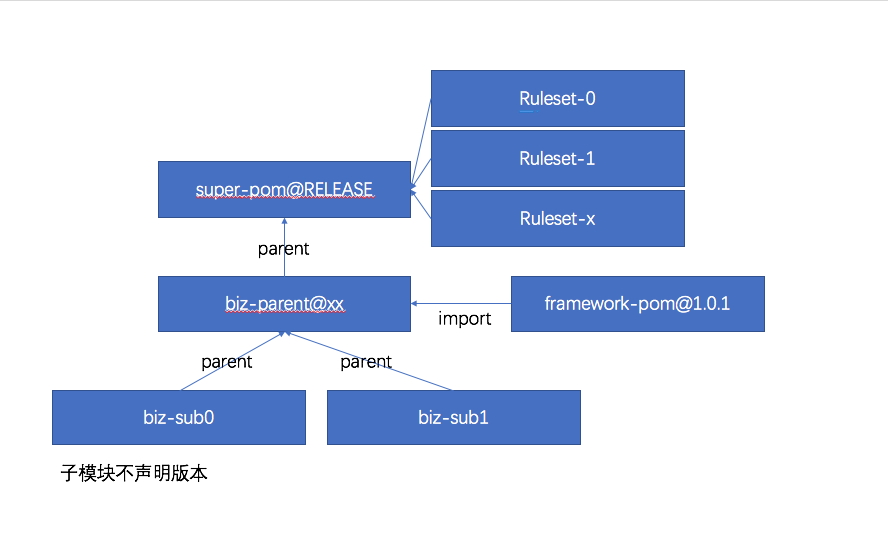

# 使用Maven Enforcer Plugin提升构建稳定性

## 场景
1. Java项目复杂多变的项目依赖，由于传递依赖导致会隐式引入额外的依赖，这些依赖通常是常用的第三方组件或者工具包，不同活跃程度的项目会引入不同版本的依赖，经常活跃的依赖往往经常进行更新发版，导致实际项目中可能从不同的依赖路径导入同一个依赖的多个版本。如下
	```text
	[WARNING] 
	Dependency convergence error for org.apache.curator:curator-framework:2.5.0 paths to dependency are:
	+-com.youzan.bigdata:seller-datacenter-deploy:1.4.5-RELEASE
	  +-com.youzan.platform:bootstrap:3.1.5.2-RELEASE
		+-com.alibaba:dubbo:3.1.5-RELEASE
		  +-org.apache.curator:curator-framework:2.5.0
	and
	+-com.youzan.bigdata:seller-datacenter-deploy:1.4.5-RELEASE
	  +-com.youzan.bigdata:seller-datacenter-wsc-service:1.4.5-RELEASE
		+-com.youzan.bigdata:common-util:1.4.5-RELEASE
		  +-com.youzan.replay:replay-core-api:1.2.5-RELEASE
			+-com.youzan.platform:spring-nsq:1.0.3.5-RELEASE
			  +-org.apache.curator:curator-framework:2.8.0
			  
	[WARNING] 
	Dependency convergence error for com.fasterxml.jackson.core:jackson-databind:2.8.9 paths to dependency are:
	+-com.youzan.bigdata:seller-datacenter-deploy:1.4.5-RELEASE
	  +-com.youzan.platform:bootstrap:3.1.5.2-RELEASE
		+-com.alibaba:dubbo:3.1.5-RELEASE
		  +-org.mousio:etcd4j:2.13.1-YOUZAN-RELEASE
			+-com.fasterxml.jackson.core:jackson-databind:2.8.9
	and
	+-com.youzan.bigdata:seller-datacenter-deploy:1.4.5-RELEASE
	  +-com.youzan.platform:bootstrap:3.1.5.2-RELEASE
		+-com.alibaba:dubbo:3.1.5-RELEASE
		  +-com.fasterxml.jackson.core:jackson-databind:2.8.9
	and
	+-com.youzan.bigdata:seller-datacenter-deploy:1.4.5-RELEASE
	  +-com.youzan.platform:bootstrap:3.1.5.2-RELEASE
		+-com.fasterxml.jackson.core:jackson-databind:2.8.9
	and
	+-com.youzan.bigdata:seller-datacenter-deploy:1.4.5-RELEASE
	  +-com.youzan.platform:bootstrap:3.1.5.2-RELEASE
		+-com.fasterxml.jackson.module:jackson-module-afterburner:2.8.9
		  +-com.fasterxml.jackson.core:jackson-databind:2.8.9
	and
	+-com.youzan.bigdata:seller-datacenter-deploy:1.4.5-RELEASE
	  +-com.youzan.bigdata:seller-datacenter-wsc-service:1.4.5-RELEASE
		+-com.youzan.bigdata:common-util:1.4.5-RELEASE
		  +-com.youzan.replay:replay-core-api:1.2.5-RELEASE
			+-com.youzan:DCC-Client:1.1.0622-RELEASE
			  +-com.fasterxml.jackson.core:jackson-databind:2.7.9.1
	and
	+-com.youzan.bigdata:seller-datacenter-deploy:1.4.5-RELEASE
	  +-com.youzan.bigdata:seller-datacenter-wsc-service:1.4.5-RELEASE
		+-com.youzan.bigdata:common-util:1.4.5-RELEASE
		  +-com.youzan.replay:replay-core-api:1.2.5-RELEASE
			+-com.youzan:NSQ-Client:2.4.1.5-RELEASE
			  +-com.fasterxml.jackson.core:jackson-databind:2.8.6
	and
	+-com.youzan.bigdata:seller-datacenter-deploy:1.4.5-RELEASE
	  +-com.youzan.bigdata:seller-datacenter-wsc-service:1.4.5-RELEASE
		+-com.youzan.bigdata:common-util:1.4.5-RELEASE
		  +-com.youzan:sams-staff-service:1.1.3-RELEASE
			+-com.youzan:sams-new-service:1.1.3-RELEASE
			  +-com.youzan:sams-new-base:1.1.3-RELEASE
				+-com.fasterxml.jackson.core:jackson-databind:2.8.8
	```
	同一个依赖不同版本的共存会导致运行时不确定的加载行为。比如使用到的某个类，在版本A中存在，在版本B中被过时删除了，某个方法在版本A中没有，在版本B中新增，这类问题在开发和运行时不一定能稳定发生，这取决于ClassPath的定义。可能在本地正常运行，但是在服务器上却被报告`ClassNotFoundException`或者`MethodNotFoundException`。不确定的加载行为对于软件的稳定性构成威胁，并且对于没有处理此类问题经验的开发人员来说是比较难以想象的。

2. 某个开源组件被报告存在安全漏洞，但是不同团队不同项目可能并不能得到及时的修复，由于没有集中管控，无法强制实施禁止存在漏洞版本的组件继续被使用，也无法项目强制升级此组件，导致系统存在被攻击的风险。例如struts历史版本中存在较多的任意代码执行、spring messaging api中的任意代码执行等。

3. 内部中间件的统一发版与版本配合。公司中间件团队发版后，需要协调不同组件能互相配合的版本，比如DAL组件和数据连接池监控组件，监控组件和统一日志收集组件、服务框架和配置组件，由于版本迭代，可能组件A的1.0需要依赖组件B的1.1才能正常工作，而业务团队项目中单独配置了组件A和组件B的版本可能就无法协同工作了，如何统一管控私有组件的版本，保证组件功能的正确性，是中间件团队对外输出的重要质量指标。

4. 多模块项目的误区（Multi-Module Project Anti-Pattern）。Maven项目管理中，多模块项目经常用于拆分项目，有按照功能维度拆分的（如查询、管理、呈现等），有按照层级维度拆分的（数据库访问、数据聚合、业务逻辑、对外接口、引用的外部接口等），这样的拆分对于项目管理和持续高质量是有益的，但是大家经常对于多模块项目中的子模块配置不同的版本号，各模块单独一个版本序列，这么做并不一定正确。
	1. 如果此多模块项目中某个模块被定位为提供给此项目以外的项目使用，例如公共类库，通用类库等，那么它和它的父级以及它所依赖的兄弟模块**应该**被部署到依赖仓库（Maven Repository）并且每次发布都**必须要**升级版本，并且遵循语义化版本规范。
	2. 如果某个模块只是本项目中被使用到，那么请**一定不要**将它发布到依赖仓库。
	3. 业务项目中可运行的产物（如war、jar、tar.gz）等**一定不要**将它发布到依赖仓库。
	4. 不需要发布到依赖仓库中的模块，**一定不要**进行版本标识（因为没用）。
	5. 对于你正在开发的多模块项目，**不要**使用`mvn install`，同样也不建议发布工具使用`mvn install`，因为`mvn install`会污染本地仓库，导致不确定的类加载路径（有可能是加载的本项目的类，也可能是加载的是你安装到本地仓库的类，也可能是远程仓库下载下来的放在本地仓库的类）。
	6. 多模块项目中，一但子模块使用各自的版本号，那么可能导致不同子模块使用不同的父级版本，产生不一致的依赖树，导致依赖冲突。
	7. 基于以上规则，只有会被外部使用的模块需要明确版本概念，内部使用不需要版本（版本是通过VCS实现）。并且，如果一个多模块项目中存在不被外部使用的模块，建议拆分成多个项目，每个对外模块分离成为一个项目或视模块配合关系重组到另外一个多模块项目，例如store-api和customer-api没有任何关联，应当分布单独一个项目，而abc-core和abc-client则必须要配合使用，应该作为一个单独项目的两个子模块，并保持相同版本号，每次发版一起发版。
	8. 综上，多模块项目，对于子模块不要使用单独的版本号。1.不对外的模块版本号没有意义 2.对外的模块单独一个项目,多模块项目多个模块的版本相同。
	
	但是经常有项目没有特别的要求，将任何子模块单独编辑版本，并且发布到依赖仓库。这实际上是错误地使用了Maven的多模块功能。如何保证各业务的项目正确实践多模块项目？
	
## [Maven Enforcer Plugin](https://maven.apache.org/enforcer/maven-enforcer-plugin/)
[Maven Enforcer Plugin](https://maven.apache.org/enforcer/maven-enforcer-plugin/)针对Maven项目中的实践问题，提供了针对环境、OS、JDK、依赖等的强制约束能力，根据配置的具体规则对项目进行约束检查，报告违规情况。Plugin提供了[内置规则](https://maven.apache.org/enforcer/enforcer-rules/index.html)和[自定规则API](https://maven.apache.org/enforcer/enforcer-api/)，可针对具体需求进行定制。

## 针对上述场景的方案
1. 禁止项目中重复声明某个依赖 [banDuplicatePomDependencyVersion](https://maven.apache.org/enforcer/enforcer-rules/banDuplicatePomDependencyVersions.html)
	
	禁止通过传递引入依赖的不同版本 [dependencyConvergence](https://maven.apache.org/enforcer/enforcer-rules/dependencyConvergence.html)
2. 禁止使用某个组件 [bannedDependencies](https://maven.apache.org/enforcer/enforcer-rules/bannedDependencies.html)
3. 框架组提供管理好版本号的POM，供业务团队使用。通过Maven POM中声明中间件版本组合为[`dependencyManagement`](https://maven.apache.org/guides/introduction/introduction-to-dependency-mechanism.html)，业务团队不需要在引用时写死版本号，只要中间件团队去组织好各中间件能配合使用的版本组合，业务团队不用关心怎么配合使用，使用POM导入的就是已经配合好了的
4. 多模块项目检查子模块版本和父级是否一致 [reactorModuleConvergence](https://maven.apache.org/enforcer/enforcer-rules/reactorModuleConvergence.html)
5. 架构部将通用规则和配置提取到一个Super-POM中，各业务团队需直接或者间接继承自此POM。公司级别规则应用于此Super-POM，这样对于通行规则，可以进行强制约束，此Super-POM使用逻辑版本`RELEASE`或`LATEST`被其他项目继承。Super-POM中仅包含规则和Plugin配置，不包含依赖等。由于是使用`LATEST`或者`RELEASE`，子项目不需要每次规则修改时去更新此POM版本，新的构建将应用最新的规则。[关于LATEST和RELEASE的说明]()
	
6. Maven Enforcer提供了扩展API，可以根据需求进行定制，以适应不同组织的不同需求。

## 横向方案比较
1. [Aladdin](http://gitlab.qima-inc.com/soa/aladdin) OR [sofa-ark](https://github.com/alipay/sofa-ark)
	
	从类加载器(ClassLoader)进行不同版本的依赖接管和隔离。其中Aladdin会在运行时接管类加载来使用统一管控平台上配置的依赖版本进行替换，没有配置的依赖仍然是不稳定的，并且由于是运行时替换，对开发者不可感知，属于无侵入式，但如果出现问题将难以定位。个人觉得Aladdin更适用于功能单一、依赖不复杂的中间件进行托管和管控，如果中间件本身依赖比较复杂，这样托管将特别容易产生编译时依赖和运行时依赖不一致的情况。
	sofa-ark主要用作类隔离，提供不同组件对同一依赖的不同版本共存适用，不提供管控功能。并且需要针对ark开发适用ark的plugin和app，对开发方式转变较大，其核心思路和Java 9的模块化类似。
	
2. 配置依赖的scope为`provided`。将组建依赖配置为provided后，依赖将不会被传递。如果项目中没有引入相关依赖或者引入版本不同的依赖会导致启动失败或者运行异常。
	```xml
	<dependency>
		<groupId>com.alibaba</groupId>
		<artifactId>fastjson</artifactId>
		<version>1.2.47</version>
		<scope>provided</scope>
	</dependency>
	```

